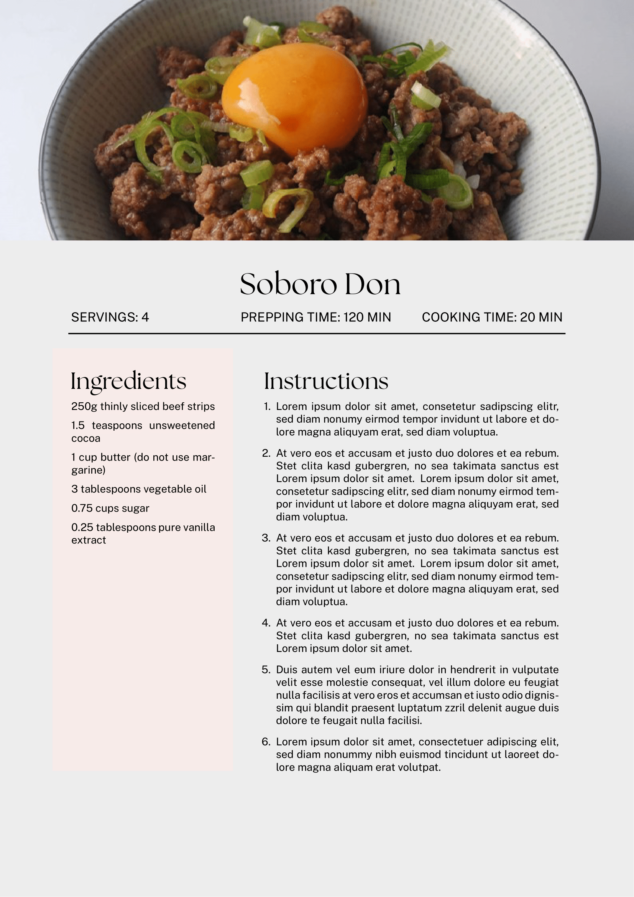

# Recipe Template

A fork of the [Craftadoc](https://craftadoc.com) template. (Using LaTeX.)

I created this fork and customized the template to my liking to finally keep track of my favorite recipes that I've been keeping on a little notepad for years. Hopefully in the future I'll create a book with all my favorite recipes that I've liked the most over the years.  I've added some user-friendly options to make it easy to set things like recipe title, number of servings, total prep time, and cooking time.

(This template uses XeLateX.)

## Example:

## Source:
https://www.reddit.com/r/LaTeX/comments/futg6z/latex_cookbookrecipe_book_template/

